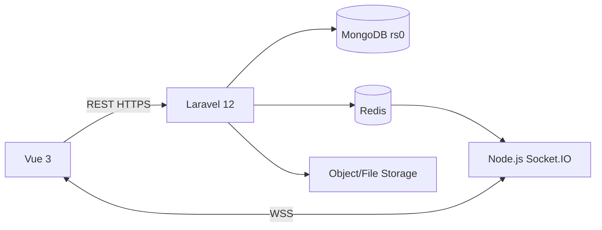

# Thiết kế kiến trúc MongoDB-only

## Quyền sở hữu

- Laravel sở hữu mọi mutation nghiệp vụ và transaction.
- MongoDB là source of truth duy nhất cho dữ liệu persistent.
- Node.js chỉ xác thực channel, chat và broadcast event; không quyết định tồn phòng.
- Redis chỉ giữ dữ liệu tạm, queue và event transport.
- Frontend không tự tính giá hoặc phân quyền để thay thế server.

## Collection chính

- `users`, `personal_access_tokens`, `password_reset_otps`.
- `hotels`, `room_types`, `rooms`, `amenities`, `room_images`.
- `bookings`, `room_nights`, `booking_services`, `booking_status_histories`.
- `services`, `vouchers`, `voucher_redemptions`.
- `payment_transactions`, `invoices`.
- `wishlists`, `reviews`, `outbox_events`.
- `conversations`, `messages`, `activity_events` khi triển khai chat/tracking.

## Ràng buộc quan trọng

- Unique `room_nights(room_id, night)` chống overbooking.
- Partial unique `bookings.idempotency_key` và `payment_transactions.idempotency_key`.
- Unique `users.email`, `bookings.code`, payment reference, invoice number và token hash.
- TTL `password_reset_otps.expires_at` và dữ liệu tracking theo retention policy.

## Khả năng lỗi

- Redis/Socket.IO lỗi: booking vẫn hoạt động, frontend fallback polling/refetch.
- Transaction abort: không có document nghiệp vụ một phần.
- Duplicate room-night: trả HTTP 409.
- MongoDB không có primary: chặn mutation, không fallback sang database khác.
